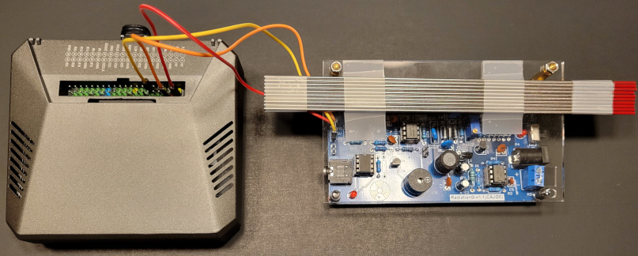
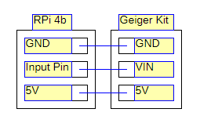

# Random Number Generator - Radioactive Decay (RNG-RD)

## Description
This hardware Random Bit Generator(RBG) relies on radioactive decay as an entropy source for generating random bits. While striving to adhere to the guidelines outlined in [NIST SP800-90B], this project does not provide any guarantees regarding full compliance. The primary goal of this project is to serve as a self-contained source of random bits for integration into various personal projects while following best practices.

## Table of contents
1. [Bit Generation](#bit-generation)
    1. [Entropy Source](#entropy-source)
    2. [Post Processing](#post-processing)
    3. [Output Format](#output-format)
2. [Entropy Validation](#entropy-validation)
    1. [Summary of Results](#summary-of-results)
    2. [Full Assessment Results](readmeAssets/SP800-90B_EntropyAssessment-results.txt)
3. [Device Construction](#device-construction)
    1. [Bill of Materials (BOM)](#bill-of-materials-bom)
    2. [Software Bill of Materials (SBOM)](#software-bill-of-materials-sbom)
    3. [RPi 4b to Geiger Kit Wire Diagram](#rpi-4b-to-geiger-kit-wire-diagram)
4. [Potential Improvements](#potential-improvements)
5. [References](#references)

## Bit Generation
### Entropy Source
The entropy source is the natural decay of thorium oxide found in 2% thoriated welding rods. Measured using an SBM-20 Geiger-Muller tube.
	
### Post Processing

This device employs a post-processing step during digitization, where it compares the intervals between two pairs of pulses to determine whether to output a '1' or '0'.

```
if(timestamps[1] - timestamps[0] == timestamps[3] - timestamps[2]):
    enough_times = False
    continue
                    
if(timestamps[1] - timestamps[0] > timestamps[3] - timestamps[2]):
    pending_bits.extend(bitarray('0'))
else:
    pending_bits.extend(bitarray('1'))
```

The original purpose of this process was to mitigate timing discrepancies caused by the low-power hardware initially utilized for this process. This approach similarly mitigates timing inaccuracies stemming from the hardware and software choices of this device.

This post-processing method was originally developed and is comprehensively explained by [HotBits].

### Output Format
The output consists of 256-byte(2048-bit) binary files with filenames consisting of SHA3-256 hashes of when the file was written. 

This naming scheme is intended to maintain a distinct identifier while concealing the specific creation timestamps.

The file size was chosen to prevent waste, as each file can only be used once for a single purpose. Smaller files that can be easily concatenated when needed minimizes the amount of wasted bits.

## Entropy Validation
The output of this RBG was tested using the entropy measurement tools described in [NIST SP800-90B] using the implementation published by The US NIST at [usnistgov/SP800-90B_EntropyAssessment].

The binary data was tested as an Independent and Identically Distributed(IID) source with no conditioning.

`./ea_iid -i -a -v output.bin`

### Summary of Results:

    Calculating baseline statistics...
        Raw Mean: 0.507345
        Median: 0.500000
        Binary: true

    Passed chi square tests

    Passed length of longest repeated substring test

    Passed IID permutation tests

[Full Assessment Results](readmeAssets/SP800-90B_EntropyAssessment-results.txt)

## Device Construction



### Bill of Materials (BOM)
* SBM-20 Geiger-Muller Tube
* Generic Geiger-Muller counter kit with output pins for analogue outputs
* Raspberry Pi 4 Model B with case
* 2% Thoriated Welding Rods diameter: 1.6mm length: 175mm
	
### Software Bill of Materials (SBOM)
* Ubuntu Server 23.10 for Raspberry Pi
* Python 3
* RPi.GPIO (system package)
* bitarray (PyPi)
* hashlib (default package)
* Time (default package)
	
### RPi 4b to Geiger Kit Wire Diagram



The data output pin on the geiger-muller counter is incorrectly labeled as "VIN"

## Potential Improvements
* Switching to a dedicated ESP32 board.
    * This improvement enables better interrupt timings and fewer missed pules that could be used for bit generation.

* Wiring additional Geiger-Muller kits to the RPi 4b.
    * Processing the pulses from each device in parallel would increase the output of bits from the device. These additional detectors would need to be isolated from each other to avoid interference between detectors.

* Switching to a radiation source with more activity
    * This would result in increased detections per second and consequently an increase in the generated bits per second.

## References
* [NIST SP800-90B]
* [usnistgov/SP800-90B_EntropyAssessment]
* [HotBits]

[NIST SP800-90B]: https://nvlpubs.nist.gov/nistpubs/SpecialPublications/NIST.SP.800-90B.pdf
[usnistgov/SP800-90B_EntropyAssessment]: https://github.com/usnistgov/SP800-90B_EntropyAssessment
[HotBits]: https://www.fourmilab.ch/hotbits/how3.html